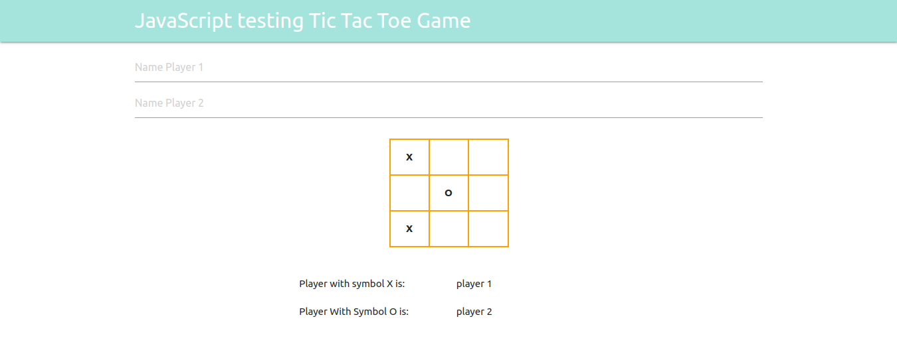
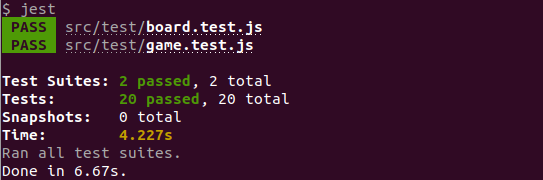

# JavaScript Testing Tic-Tac-Toe Game

> This project is focus on unit testing with JavaScript, for that reason some tests were created to the tic tac toe game.

This app tests the following functions:
 - Check win.
 - Check draw.
 - Check empty board.
 - Check board passed as a parameter.
 - Check the change of player.
 

## Built With

- HTML5
- JavaScript
- Materiaize-CSS
- Visual Code

### Prerequisites
npm 6.13.14

### Setup

To install all dependencies from a package.json file run:

 - $npm install

### Usage

To run the test go to the command line, and type one of the commands:

 - $yarn test 
  - $npm run test
  
  You will see the test result:

## Author

👤 **Gonza Javier Mancilla**

- Github: [@github/gonjavi](https://github.com/gonjavi)
- Linkedin: [linkedin](https://www.linkedin.com/in/g-javier-mancilla-a686a9178/)

## 🤝 Contributing

Contributions, issues and feature requests are welcome!

## Show your support

Give a ⭐️ if you like this project!

## 📝 License

This project is [MIT](lic.url) licensed.
